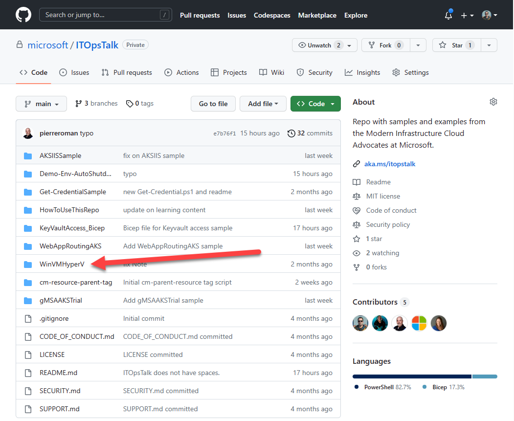
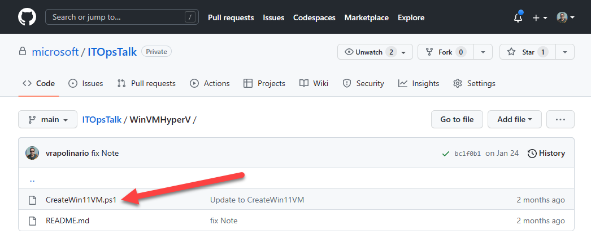
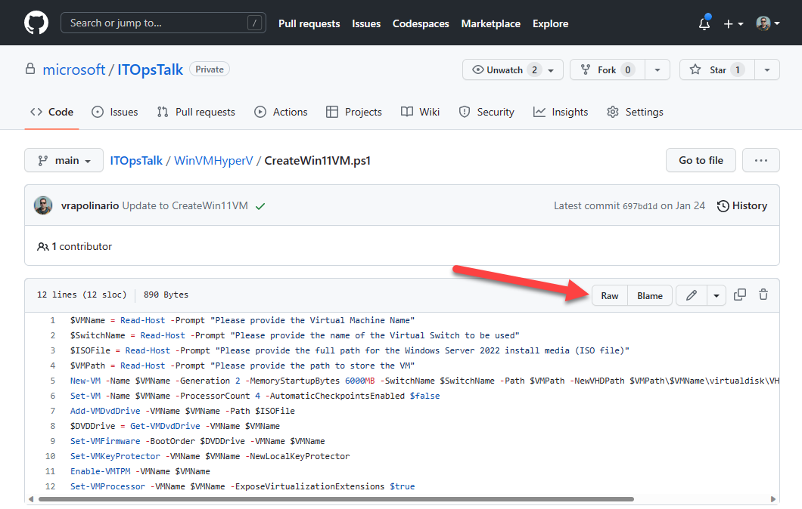
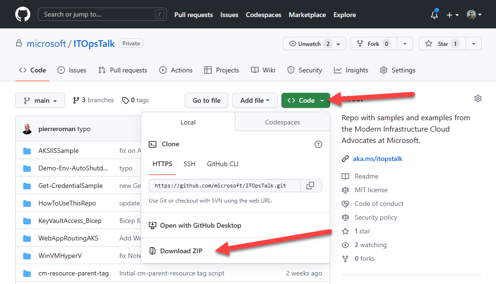
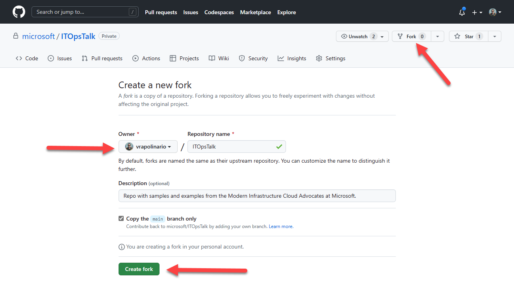
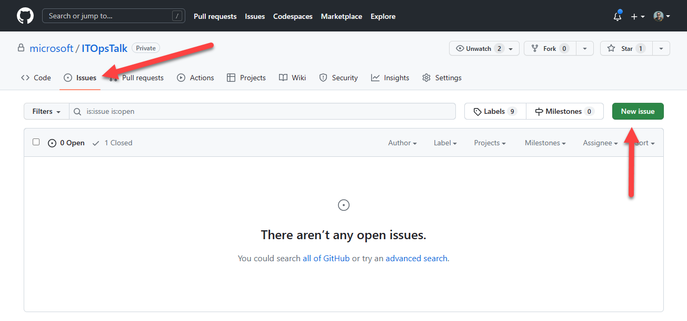

# How to use this repo

GitHub has become the central location for open-source projects, samples, and even content – but primarily focused on developers. This new repository will focus on you: The ITPro/Ops person managing the environment in your company, keeping the lights on, supporting end-users or other IT teams. As our group works on new content crafted for you on blogs and presentations, we will keep adding new samples here so you can leverage it in your environment.

## How to use this repository

If you are not familiar with GitHub, here is a quick rundown on different options for you to leverage the samples in this repo from the quick and easiest way to download the script you need, to the more advanced option of cloning the repo to your machine:

### Download the sample file

The simplest way to leverage the samples on this repo is to simply download the file you want. For example, if you’d like to download the PowerShell script (PS1 file) for the “Create Windows 11 VM on Hyper-V” sample, you can navigate to the folder:



Select the PS1 file you’d like to download:



From there you have two options. You could simply copy the content of the sample and paste on your PowerShell editor of choice, such as Visual Studio Code, PowerShell ISE, or even Notepad. Alternatively, you can click the Raw button:



The Raw option, gives you the file itself and its final URL. You can then use PowerShell to download the original file:

```powershell
wget -Uri https://raw.githubusercontent.com/microsoft/ITOpsTalk/main/WinVMHyperV/CreateWin11VM.ps1 -OutFile CreateWin11VM.ps1 -UseBasicParsing
```

This is very useful either on scenarios on which you want the original PowerShell script on your machine, but also on servers that, for example, don’t have an UI – such as Server Core installations. You can run the above command, download the script, and run it directly on that server.

Also, the same process and command above could be used to download other sample files, such as YAML files, Bicep files, etc.

### Download the entire repo

If you’d like to have a copy of all the samples in this repo, you can also download the whole thing. Simply click Code on the landing page, and Download ZIP:



This will download the whole repo and all of its content. Two things to keep in mind:
1.	This will also download the readme.md files and other GitHub items that you might not need.
2.	We’ll continue to update this repo with new samples as well as update the existing ones. Once you download this repo as in the way above, you won’t see any updates – unless you download it again later.

There’s an alternative to avoid the second issue above.

### Clone the repo on your machine

Cloning a repo is the ideal way to keep its content updated on your machine. By cloning the repo, you create a sync mechanism between the original repo and the files on your computer. Keep in mind that this sync is not automatic and you need to manually start it.

There are multiple tools to clone a repo: Git CLI, GitHub CLI, GitHub Desktop, Visual Studio Code, and many more. Here will cover one of the simplest way to accomplish this: GitHub CLI.

To get started, simply [download and install](https://cli.github.com/) the tool. Once you have it running, run the following command on PowerShell:

```powershell
gh repo clone microsoft/ITOpsTalk
```

This will clone the repository to the folder on which the context of the session was. For example, if you opened a PowerShell session on your home folder `C:\users\<username>\`, the repo will be cloned on a folder called ITOpsTalk in that location. Ideally, you will want to create a new folder for cloned repos, such as `C:\repos\`, and execute the command above from there.

After a while, if you’d like to update the cloned repo on your machine with the source on GitHub, simply use:

```powershell
gh repo sync microsoft/ITOpsTalk
```

Now you have all the updated content from the ITOpsTalk repo on your machine.

## Help us make this samples repository even better!

You can also have much more interaction with this repo. Here are a few things you can do:

### Fork the ITOpsTalk repo

If you’d like to modify the samples for your own use, you could fork the repo so you have a copy in your own GitHub account. This is useful in case you don’t want to start working on the topics that already exist in this repo from scratch. To for our repo, simply click the Fork button on the top right corner, select an owner (usually, your own GitHub account) and click Create fork:



### Start a new discussion with Issues	

You can also request new samples or point out issues on existing ones. Just go to the Issues tab on the repo and create a new issue with your comments. 



### Make contributions to this repo

If you’d like to share the improvements, changes, or even additions you made on your forked repo, you can open a PR and our team will review it. If approved, your changes will be in the original repo and your name will be featured as one of the contributors!

If you are new to GitHub, we'd recommend checking out this [blog post](https://techcommunity.microsoft.com/t5/itops-talk-blog/getting-started-with-git/ba-p/905676) on getting started with Git and the [GitHub documentation](https://docs.github.com/en/pull-requests/collaborating-with-pull-requests/proposing-changes-to-your-work-with-pull-requests/about-pull-requests) on Pull Requests.
