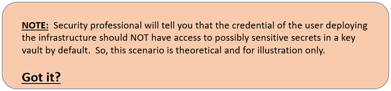

# Welcome

Hello Folks!

Have you ever had a deployment blocked because the behavior you get from the portal is different than the deployment you get from an Azure Resource Manager (ARM) template or a Bicep deployment?  Well, I had that issue for a little internal project I was working on.  Let me tell you how I resolved it using built-in Bicep functionality.

As you may know Bicep is a domain-specific language (DSL) that uses declarative syntax to deploy Azure resources.  It provides concise syntax, reliable type safety, and support for code reuse.  And as far as I’m concerned, the authoring experience is far superior to writing ARM templates.

## Scenario

Here is an example scenario. When using the portal to deploy a Key Vault. You can assign an access policy and give yourself access to get/list/set/delete/recover/backup/restore secrets.

But when you deploy any resource in Azure using a Bicep file the identity of the user\service principal executing the deployment is NOT exposed to the deployment environment.

So, to resolve this,  I used a Deployment Script, a User Assigned Identities and a role assignment.  Basically, in my Bicep deployment file I create a User Assigned Identities, assign the adequate role to that identity so it can execute the Deployment Script and get the result I am looking for.  That result is the ObjectID of the user or Service Principal that initiated the deployment.  One I have the ObjectID i can assign the Access Policy I need to the Key Vault.

Here is a sample Bicep file illustrating the process I used.
